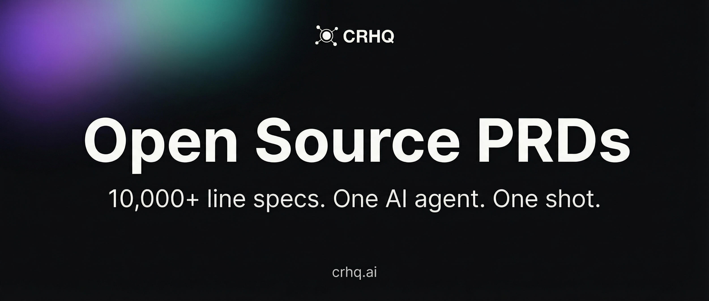

  

  <strong>Production-grade PRDs that let AI agents one-shot entire applications.</strong>

  <a href="https://crhq.ai">Website</a> •
  <a href="https://crhq.ai/docs">Docs</a> •
  <a href="https://hub.crhq.ai">CRHQ Hub</a>

---

## What Is This?

This is a collection of **extremely detailed, battle-tested Product Requirements Documents** - each one 10,000+ lines - designed to be fed directly to an AI agent so it can build a complete, production-ready application in a single shot.

No back-and-forth. No "can you also add...". No debugging prompt misunderstandings.

One PRD. One agent session. One fully working application.

This repo also includes the **skills and methodology** we use to produce PRDs at this bar - so you can write your own.

## Available PRDs

| PRD | Description | Lines | Tech Stack |
|-----|-------------|-------|------------|
| [Lightweight CRM](prds/lightweight-crm.md) | Full-featured CRM with contacts, companies, deals pipeline, activities, email integration, dashboards, and role-based access control | 10,000+ | React · Node.js · PostgreSQL · Tailwind CSS |

> More PRDs coming soon - task management, company knowledge base, and more.

## Available Skills

Skills are reusable methodologies that AI agents can follow to produce work at a consistent bar. They're how we make PRDs like the ones above.

| Skill | Description |
|-------|-------------|
| [PRD Builder](skills/prd-builder/SKILL.md) | The complete methodology for producing AI-agent-executable PRDs - seven phases, dual review, three drafts, environment-agnostic |
| [Code Refactor](skills/code-refactor/SKILL.md) | Two-mode refactoring methodology - AUDIT (rank refactor opportunities by impact) and PLAN (deep-dive specs with full pre/post verifiability loops and HTML artifact) |

Hand a skill to your agent (paste its contents, or load it as a skill in your platform) and the agent will follow the methodology to produce a PRD at the same bar as the ones in this repo.

## How To Use

### With Any AI Agent

1. Copy the contents of a PRD file
2. Feed it to your AI coding agent (Claude, GPT, Cursor, etc.)
3. The agent builds the entire application

The PRDs are written to be **self-contained and unambiguous** - every database schema, every API endpoint, every UI component, every edge case is specified. A capable AI agent can execute them without asking follow-up questions.

### With CRHQ

These PRDs were built on and optimized for [CRHQ](https://crhq.ai) - an AI agent deployment platform where autonomous agents run on dedicated servers with real tools.

On CRHQ, the workflow is:

1. Feed the PRD to your Project Manager agent
2. The PM coordinates multiple Developer agents to build it and deploy it, while Tester agents run end-to-end tests using scripts and a headless browser
3. You get a live URL with a working, tested application

No local setup. No terminal juggling. No deployment pipeline. The agents have a full Linux server, database, file system, and browser - they handle everything.

**Why it works better on CRHQ:**

- **Persistent memory** - the agent remembers every decision across sessions
- **Real tools** - file system, PostgreSQL, headless browser, cron jobs, credential vault
- **Skills system** - coding standards, UI guidelines, and best practices are enforced automatically
- **Auto-deployment** - what gets built goes live immediately
- **No context window limits** - 10,000+ line PRDs execute without truncation

> [Get started with CRHQ →](https://crhq.ai)

## What Makes These PRDs Different

Most PRDs are vague wishlists. These are **executable specifications**.

- **Every database table** is fully defined - columns, types, constraints, indexes, seed data
- **Every API endpoint** is specified - method, path, request/response schemas, error codes, auth rules
- **Every UI component** is described - layout, interactions, responsive behavior, empty states, loading states
- **Every edge case** is handled - validation rules, error messages, race conditions, permission boundaries
- **Every configuration** is included - environment variables, third-party integrations, deployment steps

An AI agent reading one of these PRDs has **zero ambiguity** about what to build.

## Who Is This For

- **Solo founders** who need production applications without a dev team
- **CTOs** evaluating AI-driven development workflows
- **Developers** who want a reference for how to write PRDs that AI can execute
- **AI enthusiasts** pushing the boundaries of what agents can build autonomously

## About CRHQ

[CRHQ](https://crhq.ai) is an AI agent deployment platform. Every user gets a dedicated cloud server - a **Satellite** - where autonomous AI agents run 24/7 with real tools: file systems, databases, browsers, scheduled jobs, persistent memory, and an encrypted credential vault.

We don't build chatbots. We build employees.

One person orchestrating a team of CRHQ agents outperforms a department 10x its size. These PRDs are proof - a single agent, given the right instructions, can build what would take a small team weeks.

  <a href="https://crhq.ai"><strong>Deploy your first agent in 90 seconds →</strong></a>

## Contributing

We welcome contributions of both PRDs and skills.

**For PRDs** (`prds/`):

- **5,000+ lines minimum** - we're not interested in toy specs
- **Fully executable** - an AI agent should be able to build the entire application from your PRD alone
- **Battle-tested** - the PRD must have been used to successfully generate a working application at least once
- **Self-contained** - no external docs, no "see also", no assumptions

**For skills** (`skills/`):

- **Tech-stack agnostic** - the methodology should work across stacks and project types
- **Battle-tested** - the skill must have been used by an agent to produce a real artifact at least once
- **Self-contained** - no environment-specific assumptions; reference the host's facilities generically
- **Folder per skill** - `skills/<skill-name>/SKILL.md` plus any supporting scripts, templates, or examples

Open a PR and we'll review it.

## License

MIT - use these PRDs however you want. Build with them, learn from them, fork them.

---

  Built by <a href="https://crhq.ai">CRHQ</a> - Autonomous AI agents on dedicated servers.

